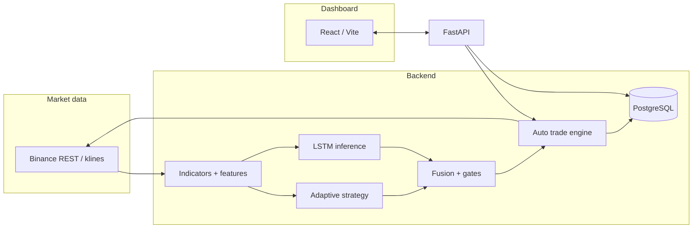

# Trading Bot — WebCrest Client

Monorepo for an **AI-assisted crypto trading system**: **FastAPI backend** (rules + **LSTM** + optional **RL**), **React/Vite dashboard**, Binance spot integration, PostgreSQL, and a live scheduler.

> **Branding / logo:** Add your logo as `docs/assets/logo.png` (or SVG) and reference it here if you want a visual header in GitHub. The dashboard build ships with Vite’s default favicon unless you add files under `trading-bot-dashboard/public/`.

---

## Table of contents

1. [What this system does](#what-this-system-does)
2. [Repository layout](#repository-layout)
3. [Architecture (high level)](#architecture-high-level)
4. [How the LSTM works](#how-the-lstm-works)
5. [Rules + ML fusion (live decisions)](#rules--ml-fusion-live-decisions)
6. [Multi-coin & scheduler](#multi-coin--scheduler)
7. [Optional: RL / PPO portfolio layer](#optional-rl--ppo-portfolio-layer)
8. [Dashboard](#dashboard)
9. [Quick start (local)](#quick-start-local)
10. [Production (VPS)](#production-vps)
11. [Useful API endpoints](#useful-api-endpoints)
12. [Safety & configuration](#safety--configuration)

---

## What this system does

| Layer | Role |
|--------|------|
| **Adaptive strategy** | Classic indicators (EMA, RSI, ADX, Bollinger, ATR) → BUY / SELL / HOLD. |
| **LSTM classifier** | Learns from OHLCV + engineered features; outputs **3-class softmax**: SELL / HOLD / BUY. |
| **Fusion** | Combines rule signal with ML signal using thresholds (prioritize, override, agree, hold-breakout, moderate influence). |
| **Execution** | Binance spot (testnet or live), positions & orders in DB, cooldowns and risk checks. |
| **Scheduler** | Optional timed cycles per symbol (multi-coin). |
| **Dashboard** | Status, exchange data, decisions, logs, ML audit panels. |

---

## Repository layout

| Path | Role |
|------|------|
| `bot new backend/` | API (`src/main.py`), exchange routes, ML (`src/ml/`), live engine (`src/live/`), scheduler, tests. |
| `trading-bot-dashboard/` | React + Vite UI; calls `/exchange/*`, `/stats/*`, `/status/*`. |
| `bot new backend/docs/` | VPS guides (`VPS-DEPLOY.md`, `VPS-VAR-WWW.md`, `VPS_SETUP.md`). |
| `bot new backend/models/` | Trained artifacts per layout: `model.keras`, `scaler.json`, `meta.json`. |

> **Deploy tip:** On Linux, rename `bot new backend` → `backend` to avoid spaces in systemd paths (see VPS docs).

---

## Architecture (high level)



---

## How the LSTM works

1. **Data**  
   Historical candles are fetched (e.g. public klines); rows are enriched with technical features (see `src/ml/dataset.py`, `src/ml/features.py`).

2. **Training (offline)**  
   - Scripts: `scripts/train_btc_production.py`, `scripts/train_multi_coin.py`.  
   - Builds sequences of length **`lookback`** (stored in `meta.json`).  
   - Labels are profit-based classes (configurable horizons/thresholds).  
   - Model file: TensorFlow **Keras** `model.keras`, **StandardScaler** in `scaler.json`, metadata in `meta.json`.

3. **Architecture (default production head)**  
   Stacked **LSTM** → **Dropout** → **LSTM** → **Dense(ReLU)** → **Dense(3, softmax)**  
   (see `src/ml/model_builder.py` — `build_production_lstm`).

4. **Inference (live)**  
   - `src/ml/inference.py` loads `model.keras`, applies scaler to the last `lookback` rows of selected features.  
   - Output: probabilities for **\[SELL, HOLD, BUY\]** (order matches `__CLASSES` in code).  
   - **Confidence** = probability of the **argmax** class.  
   - Models are **cached per resolved directory** (`get_infer(model_dir)`).

5. **Per-symbol models**  
   `src/ml/model_selector.py` resolves `models/<SYMBOL>_<timeframe>/` (or versioned dirs). Multi-coin training writes under e.g. `models/BTCUSDT_5m/`.

---

## Rules + ML fusion (live decisions)

The engine (`src/live/auto_trade_engine.py`) builds a **rule-based** signal, then optionally combines with ML:

| Priority | Condition | Typical `final_source` |
|----------|-----------|-------------------------|
| High ML confidence | ≥ `ML_PRIORITIZE_THRESHOLD` | `ml_prioritize` |
| Strong ML | ≥ `ML_OVERRIDE_THRESHOLD` | `ml_override` |
| Agreement | Same direction + ML ≥ `ML_AGREE_THRESHOLD` | `combined` |
| Directional conflict | ML between floor and override | `ml_moderate_influence` |
| Rules HOLD, ML directional | ML ≥ hold-breakout min | `ml_hold_breakout` |
| Else | Rules win | `rule_only` |

Confidence blending for audits uses `fuse_confidence()` in `src/live/cycle_decision.py`.  
Execution can apply **portfolio / hybrid** risk caps (`src/rl/hybrid.py`) when enabled.

---

## Multi-coin & scheduler

- **Symbols:** `SUPPORTED_TRADING_SYMBOLS` in env (default BTC/ETH/SOL USDT pairs). See `src/core/symbols.py` and `src/core/config.py`.
- **Scheduler** (`src/scheduler/runner.py`): each tick runs **`execute_auto_trade`** for **every** supported symbol with `trade_timeframe` from settings.
- **Inference:** separate model path per symbol via `resolve_model_selection`; each directory cached independently.

---

## Optional: RL / PPO portfolio layer

- **Not required** for core trading. Install `requirements-rl.txt` for Gymnasium + Stable-Baselines3.
- **Env:** `src/rl/trading_env.py` (multi-asset discrete actions).  
- **Training:** `scripts/train_ppo_portfolio.py`.  
- **Hybrid:** `src/rl/hybrid.py` can scale BUY risk when `RL_HYBRID_ENABLED` and a PPO checkpoint path are set.

---

## Dashboard

- **Stack:** React 19, TanStack Query, Vite 7, Tailwind.  
- **Dev:** Vite **proxy** `/api` → backend (see `vite.config.ts`) so same-origin calls avoid CORS issues.  
- **Production build:** set `VITE_API_BASE_URL` to your public API base (e.g. `https://yourdomain.com/api`).  
- **Panels:** Exchange performance, decisions, logs, **ML live proof** (`/stats/live-proof`, `/stats/ml-analysis` via `statsApi` in `src/apis/api-summary/summary.api.ts`).

---

## Quick start (local)

**Backend**

```bash
cd "bot new backend"
python -m venv venv
# Windows: venv\Scripts\activate
# Linux/macOS: source venv/bin/activate
pip install -r requirements.txt
pip install -r requirements-ml.txt   # TensorFlow + training/inference
cp .env.example .env                  # set DATABASE_URL, keys, ML_* 
python -m uvicorn src.main:app --reload --host 127.0.0.1 --port 8000
```

**Frontend**

```bash
cd trading-bot-dashboard
npm install
npm run dev
# Leave VITE_API_BASE_URL unset in dev to use /api proxy → http://127.0.0.1:8000
```

**Smoke checks**

```bash
curl -s http://127.0.0.1:8000/status
curl -s http://127.0.0.1:8000/health/db
```

---

## Production (VPS)

| Doc | Content |
|-----|---------|
| `bot new backend/docs/VPS-DEPLOY.md` | PostgreSQL, systemd, Nginx, TLS overview |
| `bot new backend/docs/VPS-VAR-WWW.md` | `/var/www/TRADING-BOT-WEBCREST` layout, nginx snippets |
| `bot new backend/docs/VPS_SETUP.md` | Extra setup notes (if present) |

**Minimum checklist**

- `APP_ENV=production`, strong `JWT_SECRET`, real `DATABASE_URL`.  
- `CORS_ORIGINS` = exact dashboard origin(s).  
- API behind Nginx; `uvicorn` on `127.0.0.1:8000`.  
- **One** process bound to port 8000 (avoid duplicate uvicorn).  
- Dashboard `npm run build` + static root or `VITE_API_BASE_URL` for remote API.

**Docker:** `bot new backend/docker-compose.yml` + `.env.production`.

---

## Useful API endpoints

| Endpoint | Purpose |
|----------|---------|
| `GET /status` | Env, symbol, ML flags |
| `GET /status/ml` | ML thresholds, supported symbols |
| `GET /health/db` | DB connectivity |
| `GET /stats/live-proof` | ML usage %, confidence stats |
| `GET /stats/performance` | Decisions + `by_symbol` breakdown |
| `GET /docs` | Swagger UI |

---

## Safety & configuration

- **Testnet:** `BINANCE_TESTNET=true` until you intentionally go live.  
- **ML strict:** `ML_STRICT` can abort cycles if model missing (production discipline).  
- **Floors:** `ML_ABSOLUTE_MIN_CONFIDENCE` blocks ultra-low-confidence ML-driven buys.  
- **Scheduler:** `LIVE_SCHEDULER_ENABLED` — keep off until you trust automation.  
- **Secrets:** never commit `.env`; use `SECRETS_ENCRYPTION_KEY` for stored exchange keys when enabled.

---

## License

Private / client project — adjust as needed.

---

## Maintainer notes

- After `git pull` on VPS: update venv, restart `trading-bot-api`, rebuild dashboard if UI changed.  
- If port **8000** is busy, free it (`fuser -k 8000/tcp`) or run API on another port and update Nginx.  
- For **branded README images**, add under `docs/assets/` and use standard Markdown: ``.
